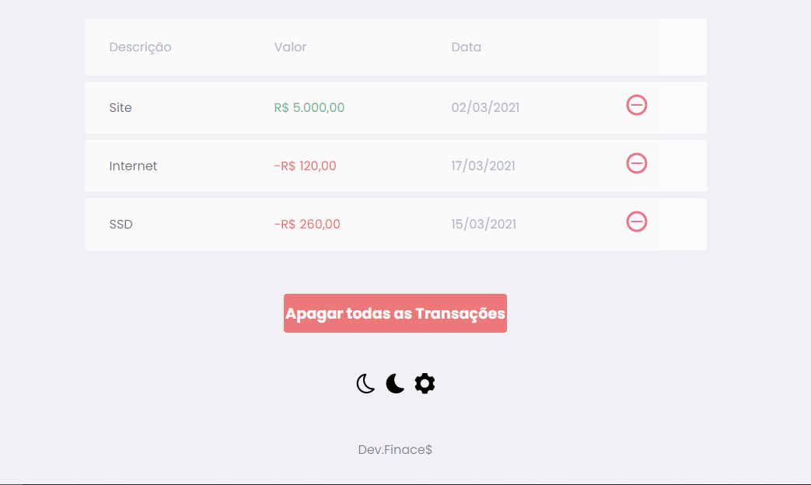
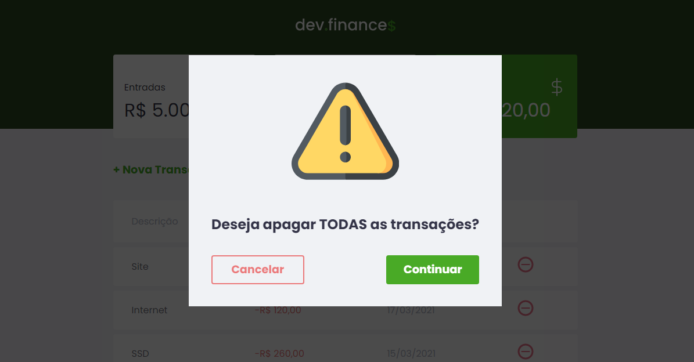
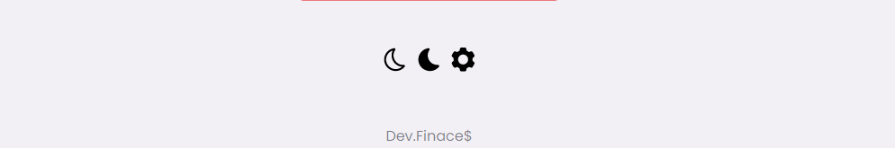
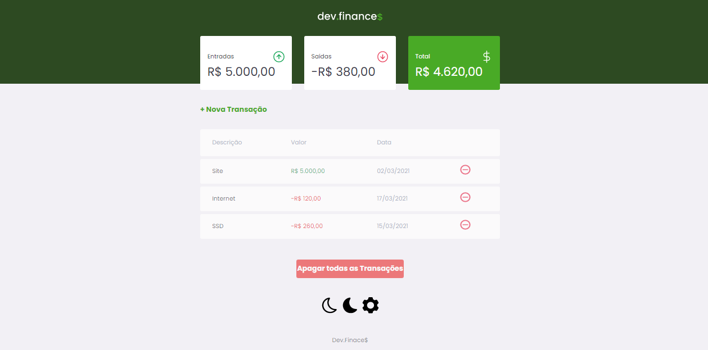
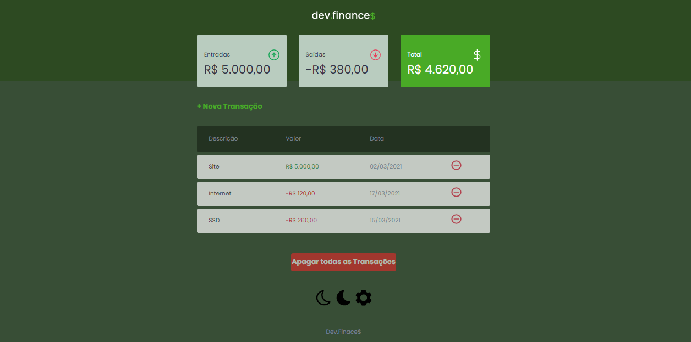

<h1 align="center">
  
</h1>

Projeto desenvolvido durante a Maratona Discorver da <a href="https://github.com/rocketseat-education/maratona-discover-01">Rockeseat</a> no qual adicionei algumas funcionalidades extras

  <a href="#tecnologias">Tecnologias</a>&nbsp;&nbsp;&nbsp;|&nbsp;&nbsp;&nbsp;
  <a href="#projeto">Projeto</a>&nbsp;&nbsp;&nbsp;|&nbsp;&nbsp;&nbsp;
  <a href="#screenshots">Screenshots</a>&nbsp;&nbsp;&nbsp;|&nbsp;&nbsp;&nbsp;
  <a href="#novas funcionalidades">Novas Funcionalidades</a>&nbsp;&nbsp;&nbsp;|&nbsp;&nbsp;&nbsp;

## Tecnologias

Esse projeto foi desenvolvido com as seguintes tecnologias:

- HTML
- CSS
- JavaScript

## Projeto

O dev.finances é uma aplicação de controle financeiro, onde é possível cadastrar e excluir transações e ver o saldo de entrada e saída.

## Novas Funcionalidades

<h3>Deletar todas as transações</h3>
  
Por essa opção é possivel deletar todas as transações

  

  

  
Funciona apagando as transações existentes nos <strong>LocalStorage</strong> do navegador

<h3>Switch DarkMode e LightMode</h3>
  
Pode alternar entre Light e Dark Mode para uma experiência melhor dos olhos

  

  
Funciona por meio de uma função que altera os estilos CSS

 
## Screenshots

<h1 align="center">
  
  
</h1>
